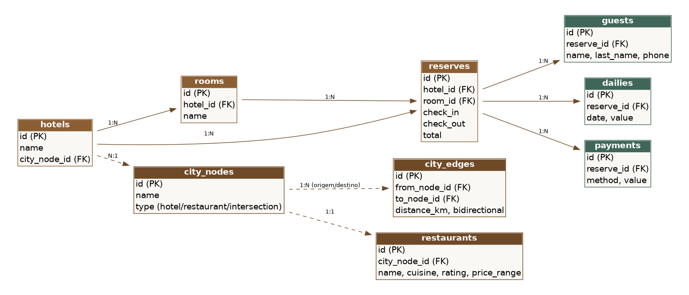

# Hotel API

API REST para gestão de quartos e reservas de hotel. Ela importa hotéis, quartos e reservas a partir de arquivos XML (via comando agendado), expõe CRUD de hotéis e quartos, cria reservas impedindo períodos sobrepostos no mesmo quarto e recomenda restaurantes próximos ao hotel calculando a menor rota com o algoritmo de Dijkstra.

## Sumário

- [Tecnologias](#tecnologias)
- [Pré-requisitos](#pré-requisitos)
- [Instalação e execução](#instalação-e-execução)
- [Variáveis de ambiente](#variáveis-de-ambiente)
- [Migrations, seeders e importação](#migrations-seeders-e-importação)
- [Testes automatizados](#testes-automatizados)
- [Painel administrativo (hotel-admin.html)](#painel-administrativo-hotel-adminhtml)
- [Collection do Postman](#collection-do-postman)
- [Endpoints e fluxos principais](#endpoints-e-fluxos-principais)
- [Modelo de dados](#modelo-de-dados)
- [Arquitetura](#arquitetura)
- [Decisões técnicas](#decisões-técnicas)
- [Limitações conhecidas](#limitações-conhecidas)
- [Melhorias futuras](#melhorias-futuras)

## Tecnologias

- PHP 8.2+ e Laravel 12
- MySQL 8 (aplicação) e SQLite em memória (testes automatizados)
- PHPUnit 11
- Docker e Docker Compose
- Painel administrativo em HTML/CSS/JavaScript puro (sem build)

## Pré-requisitos

**Com Docker (recomendado):** Docker e Docker Compose v2.

**Sem Docker:** PHP 8.2+ (extensões `pdo_mysql`, `pdo_sqlite`, `simplexml`, `mbstring`, `zip`), Composer 2 e um servidor MySQL 8 (ou SQLite, veja abaixo).

## Instalação e execução

### Opção A: Docker

```bash
git clone <url-do-repositorio> hotel-api
cd hotel-api
docker compose up --build
```

Sobem dois containers: `hotel-mysql` (porta 3306) e `hotel-api` (porta 8000). Na inicialização, o container da API espera o MySQL responder, executa as migrations e o seeder e inicia o servidor. Nenhum arquivo `.env` precisa ser criado: as variáveis de banco são definidas no `docker-compose.yml`.

- API: <http://localhost:8000/api>
- Painel administrativo: <http://localhost:8000/admin/hotel-admin.html>

Comandos úteis no container em execução:

```bash
docker compose exec app php artisan import:xml
docker compose exec app php artisan test
```

### Opção B: sem Docker

```bash
composer install
cp .env.example .env
php artisan key:generate
# ajuste as variáveis DB_* do .env para o seu MySQL ou use SQLite (veja a próxima seção)
php artisan migrate
php artisan db:seed
php artisan serve
```

A API fica em <http://localhost:8000/api>.

## Variáveis de ambiente

Exemplo de `.env` (o arquivo `.env.example` já contém estes valores):

```dotenv
APP_NAME="Hotel API"
APP_ENV=local
APP_KEY=            # gerado por `php artisan key:generate`
APP_DEBUG=true
APP_URL=http://localhost:8000

DB_CONNECTION=mysql
DB_HOST=127.0.0.1
DB_PORT=3306
DB_DATABASE=hotel_api
DB_USERNAME=hotel_api
DB_PASSWORD=secret

CACHE_STORE=file
SESSION_DRIVER=array
QUEUE_CONNECTION=sync
```

Para rodar sem MySQL (por exemplo, se o PHP não tiver a extensão `pdo_mysql`), use SQLite:

1. Crie o arquivo do banco: `touch database/database.sqlite` (Linux/macOS) ou `New-Item database/database.sqlite` (PowerShell).
2. No `.env`, defina `DB_CONNECTION=sqlite` e remova as demais variáveis `DB_*` (`DB_HOST`, `DB_PORT`, `DB_DATABASE`, `DB_USERNAME`, `DB_PASSWORD`).
3. Rode `php artisan migrate --seed`.

As credenciais acima são apenas para desenvolvimento local e existem também no `docker-compose.yml`. Não as reutilize em outros ambientes.

## Migrations, seeders e importação

```bash
php artisan migrate          # cria as tabelas
php artisan db:seed          # importa os XMLs de database/xml e cria o mapa de exemplo
php artisan import:xml       # apenas a importação (all | hotels | rooms | reserves)
php artisan migrate:fresh --seed   # recria o banco do zero
```

- `DatabaseSeeder` executa a importação dos XMLs e o `CityGraphSeeder` (mapa de exemplo com 3 hotéis, 3 cruzamentos e 5 restaurantes).
- A importação é idempotente: cada registro é identificado pelo ID do XML (`updateOrCreate`), então repetir o comando não duplica dados.
- Os hotéis, quartos e reservas de exemplo estão em `database/xml/`.

### Agendamento (cron)

A importação está agendada em `routes/console.php` para rodar a cada hora, gravando a saída em `storage/logs/import.log`. O agendador do Laravel só executa se o cron do sistema o acionar a cada minuto:

```cron
* * * * * cd /caminho/para/hotel-api && php artisan schedule:run >> /dev/null 2>&1
```

## Testes automatizados

```bash
php artisan test
# ou, dentro do Docker:
docker compose exec app php artisan test
```

Os testes usam SQLite em memória (definido em `phpunit.xml` com `force="true"`), portanto não alteram o banco MySQL de desenvolvimento, nem dentro do Docker.

| Arquivo | Cobertura |
|---|---|
| `tests/Unit/ReserveServiceTest.php` | Disponibilidade: sobreposição total/parcial, limites de check-in/check-out, quartos independentes, cálculo do total |
| `tests/Unit/DijkstraServiceTest.php` | Algoritmo com grafos montados em memória: caminho direto vs. mais curto, destino inalcançável, mão única |
| `tests/Feature/ReserveApiTest.php` | Criação de reserva (201), conflito (409), validação (422), endpoint de disponibilidade |
| `tests/Feature/ImportApiTest.php` | Importação por HTTP e pelo comando, idempotência |
| `tests/Feature/RestaurantRecommendationApiTest.php` | Ordenação por distância e filtros |
| `tests/Feature/CityGraphManagementApiTest.php` | Cadastro de pontos, ruas e restaurantes |

## Painel administrativo (hotel-admin.html)

Interface web simples para operar a API: CRUD de hotéis e quartos, consulta de disponibilidade, criação de reservas, importação dos XMLs e recomendação de restaurantes com o mapa e a rota calculada.

- **Localização:** `public/admin/hotel-admin.html`
- **Como abrir:** com a API em execução (`docker compose up` ou `php artisan serve`), acesse <http://localhost:8000/admin/hotel-admin.html>. Servido pelo próprio Laravel, o painel usa automaticamente `<origem>/api` como base.
- **Alternativa:** abrir o arquivo diretamente no navegador. Nesse caso a base padrão é `http://localhost:8000/api` e pode ser alterada no campo do topo da página (a API aceita requisições de qualquer origem, veja [Limitações](#limitações-conhecidas)).

Sugestão de roteiro: aba **Importar XML** > "Importar tudo"; aba **Quartos** para consultar disponibilidade; aba **Reservas** para criar uma reserva e tentar outra no mesmo período (a API responde com conflito); aba **Restaurantes (Dijkstra)** para escolher um hotel e clicar nas recomendações para ver a rota no mapa.

## Collection do Postman

- **Arquivo:** `docs/postman/hotel-api.postman_collection.json`
- **Importar:** Postman > **Import** > selecione o arquivo (ou arraste-o para a janela).
- **Variável:** a collection define `base_url` com o valor `http://localhost:8000/api`. Para outra porta ou host, edite-a na aba **Variables** da collection.
- **Fluxo básico:**
  1. `Import > Importar tudo` popula hotéis, quartos e reservas.
  2. `Rooms > Verificar disponibilidade (ocupado: false)` e `(livre: true)`.
  3. `Reserves > Criar reserva (deve dar 201)`, depois `Criar reserva com conflito (deve dar 409)` e `Criar reserva inválida (deve dar 422)`.
  4. `Restaurants (Dijkstra) > Recomendações para o hotel 1`, e as variações com filtros.
  5. Para cadastrar um restaurante: `Cadastrar restaurante` e, em seguida, `Cadastrar rua`, ajustando `to_node_id` para o `city_node_id` devolvido na resposta anterior (no mapa de exemplo, o primeiro novo ponto recebe o id 12).

Execute `Remover reserva` por último: ela apaga a reserva 1, que é usada no exemplo de conflito.

## Endpoints e fluxos principais

Prefixo `/api`.

| Método | Rota | Descrição |
|---|---|---|
| POST | `/import/all`, `/import/{hotels\|rooms\|reserves}` | Importa os XMLs (equivalente ao comando `import:xml`) |
| GET, POST | `/hotels` | Lista e cria hotéis |
| GET, PUT/PATCH, DELETE | `/hotels/{id}` | Detalha, atualiza e remove um hotel |
| GET, POST | `/rooms` | Lista e cria quartos |
| GET, PUT/PATCH, DELETE | `/rooms/{id}` | Detalha, atualiza e remove um quarto |
| GET | `/rooms/{id}/availability?check_in=&check_out=` | Disponibilidade no período |
| GET, POST | `/reserves` | Lista e cria reservas |
| GET, DELETE | `/reserves/{id}` | Detalha e remove uma reserva |
| GET, POST | `/restaurants` | Lista e cadastra restaurantes |
| GET | `/restaurants/{id}` | Detalha um restaurante |
| GET | `/hotels/{id}/restaurants/recommendations` | Restaurantes por menor rota (filtros: `cuisine`, `max_distance_km`, `min_rating`) |
| GET | `/city-graph` | Pontos e ruas do mapa |
| POST | `/city-graph/nodes`, `/city-graph/edges` | Cadastra ponto e rua |

### Criar uma reserva

```bash
curl -X POST http://localhost:8000/api/reserves \
  -H "Content-Type: application/json" -H "Accept: application/json" \
  -d '{
    "hotel_id": 1,
    "room_id": 2,
    "check_in": "2026-12-01",
    "check_out": "2026-12-03",
    "guests": [{"name": "Ana", "last_name": "Pereira", "phone": "5571999990000"}],
    "dailies": [
      {"date": "2026-12-01", "value": 150},
      {"date": "2026-12-02", "value": 150}
    ],
    "payments": [{"method": 1, "value": 300}]
  }'
```

Respostas: `201` com a reserva criada; `409` se o quarto já tem reserva sobreposta; `422` para dados inválidos (inclusive quarto que não pertence ao hotel informado). Sem `total`, ele é a soma das diárias.

### Recomendar restaurantes

```bash
curl "http://localhost:8000/api/hotels/1/restaurants/recommendations?cuisine=italiana&max_distance_km=3"
```

Cada item traz o restaurante, `distance_km` e `route_node_ids` (a sequência de pontos do mapa percorrida).

### Cadastrar um restaurante e ligá-lo ao mapa

```bash
# 1. cria o restaurante e o ponto do mapa (a resposta traz "city_node_id")
curl -X POST http://localhost:8000/api/restaurants -H "Content-Type: application/json" \
  -d '{"node_name":"Restaurante Novo","name":"Restaurante Novo","cuisine":"brasileira","rating":4.5,"price_range":"$$"}'

# 2. liga o novo ponto a uma rua existente (sem isso ele não é alcançável)
curl -X POST http://localhost:8000/api/city-graph/edges -H "Content-Type: application/json" \
  -d '{"from_node_id": 4, "to_node_id": <city_node_id>, "distance_km": 0.6}'
```

## Modelo de dados



- `docs/schema-mysql.sql` contém o schema equivalente em MySQL. No MySQL Workbench, use **File > Import > Reverse Engineer MySQL Create Script...** para gerar o diagrama EER a partir dele. Com o `docker compose up` em execução, também é possível usar **Database > Reverse Engineer...** conectando a `127.0.0.1:3306` (usuário `hotel_api`, senha `secret`, banco `hotel_api`).
- `hotels`, `rooms` e `reserves` usam como chave primária o ID presente nos XMLs. `guests`, `dailies`, `payments` e as tabelas do mapa (`city_nodes`, `city_edges`, `restaurants`) usam ids auto-incrementais.
- Cada reserva refere-se a um único quarto e a um período; `guests`, `dailies` e `payments` detalham a estadia.

## Arquitetura

Camadas `Controller → Service → Model`: os controllers validam a entrada (Form Requests) e delegam; as regras ficam nos services.

```
app/
├── Console/Commands/ImportHotelData.php          # php artisan import:xml
├── Http/Controllers/Api/                         # camada HTTP
├── Http/Requests/                                # validação de entrada
├── Models/                                       # Eloquent
├── Services/
│   ├── ImportService.php                         # leitura e persistência dos XMLs
│   ├── ReserveService.php                        # disponibilidade e criação de reservas
│   ├── DijkstraService.php                       # algoritmo (independente do banco)
│   └── RestaurantRecommendationService.php       # recomendações a partir do hotel
└── Exceptions/
database/{migrations,seeders,factories,xml}
public/admin/hotel-admin.html
docs/{database-diagram.png,schema-mysql.sql,postman/}
```

## Decisões técnicas

- **Disponibilidade:** o período é semiaberto `[check_in, check_out)`; o dia de check-out de uma reserva não bloqueia um check-in no mesmo dia. Conflito: `check_in < novo_check_out AND check_out > novo_check_in` para o mesmo quarto.
- **Datas sem cast `date`:** `check_in`, `check_out` e a data das diárias são guardadas como `Y-m-d` puro. O cast `date` do Eloquent as grava como `Y-m-d 00:00:00`, o que, em SQLite, quebra a comparação por string usada na checagem de conflito.
- **Criação atômica:** a reserva é criada em transação, com `lockForUpdate` na checagem de conflito para serializar requisições concorrentes (efetivo em MySQL/InnoDB).
- **Importação idempotente:** `updateOrCreate` pelo ID do XML; hóspedes, diárias e pagamentos de cada reserva importada são recriados.
- **Dijkstra isolado:** `DijkstraService` não depende do banco (`addEdge` monta o grafo em memória), o que permite testá-lo sem infraestrutura. O grafo é recarregado do banco a cada recomendação, e um único cálculo a partir do hotel serve a todos os restaurantes.
- **Mapa:** `city_nodes` (hotel, restaurante ou cruzamento) e `city_edges` (distância em km, mão única ou dupla).

## Limitações conhecidas

- **IDs de reservas criadas pela API:** como a chave primária não é auto-incremental, a API usa `max(id)+1` (a partir de 9.000.000). Duas criações simultâneas em quartos diferentes podem calcular o mesmo ID e uma delas falhar.
- **Sem autenticação ou autorização**, e CORS liberado para qualquer origem (`config/cors.php`). Adequado a ambiente local; restrinja antes de expor a API.
- **Listagens sem paginação.**
- **Exclusões são definitivas e em cascata:** remover um hotel remove seus quartos e reservas; cancelar uma reserva a apaga (não há status).
- **Importação:** o XML é lido inteiro em memória e as reservas importadas não passam pela checagem de sobreposição (os dados do arquivo são tratados como confiáveis).
- **Pagamentos** são armazenados, mas não conciliados com o total da reserva.
- **Mapa:** as distâncias são informadas manualmente (não há geocodificação) e o grafo é recarregado a cada requisição, sem cache. O painel desenha apenas o mapa de exemplo (posições fixas para os pontos 1 a 11) e lista fixamente os 3 hotéis de exemplo.
- **Testes em SQLite, aplicação em MySQL:** o `lockForUpdate` não tem efeito em SQLite, e não há pipeline que execute a suíte contra MySQL.
- **Imagem Docker voltada a desenvolvimento:** usa `php artisan serve`, mantém dependências de desenvolvimento e `APP_DEBUG=true`.

## Melhorias futuras

- Identificador próprio auto-incremental para reservas, separado do ID externo do XML.
- Autenticação e restrição de CORS.
- Paginação e filtros nas listagens; status de reserva em vez de exclusão.
- Documentação OpenAPI.
- Pipeline de integração contínua executando os testes também contra MySQL.
